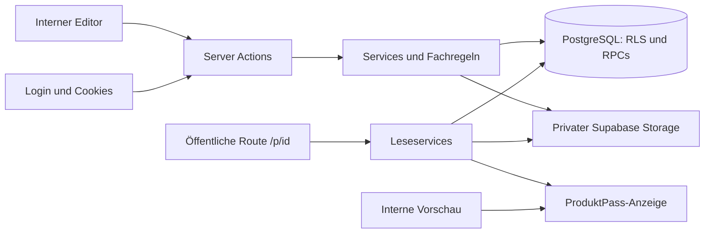

# Lotsora: Repository-, Gate- und Architekturanalyse

Stand: 10.09.2026. Status: Bericht und Empfehlung zur Freigabe; keine Implementierungsfreigabe und keine Gate-Abnahme.

**Historischer Analysebestand:** Nach diesem Bericht wurde der Einstieg in die Umsetzung freigegeben. F01/F02/F04 und ein Teil von F08 sind inzwischen bearbeitet. Der geprüfte Stand vom 12.09.2026 steht im [Abschlussprotokoll](ABSCHLUSS-2026-09-12.md); die ursprünglichen Befunde bleiben unten nachvollziehbar erhalten.

## 1. Aktueller Projektstand und Aussagegrenzen

**Lotsora kann auf dem bestehenden Grundgerüst weitergebaut werden. Ein Neubau ist weder nötig noch sinnvoll.** Der modulare Textilkern, Supabase, Service-Schicht und dauerhafte öffentliche Identitäten tragen die weitere Entwicklung. Vor Erweiterungen müssen jedoch die bestehenden Zugriffs-, Datenintegritäts- und Gate-Lücken geschlossen werden. Eine vollständige Template-Engine, KI oder ein Unternehmensrollenmodell sind dafür nicht erforderlich.

### Tatsächlich geprüfter Stand

| Gegenstand | Befund am 10.09.2026 |
|---|---|
| Lokaler Ausgangspunkt | Branch codex/n2-startseite-datenschutz, Commit 4c2075537e14771f627f054e14e5e8bb5a77d673; Arbeitsverzeichnis vor der Analyse sauber |
| GitHub lotsora/main | c0ff3225261b5cc91606ec05bd654f2d57adee9a, Tag 27 |
| GitHub Entwicklungsbranch | Identisch mit lokalem HEAD; N1 und N2 sind bereits gepusht, zwei Commits vor main |
| PRs | PR #1 und #2 in der lokalen Merge-Historie; GitHub-PR-Suche liefert diese beiden, keinen offenen N1/N2-PR |
| Dokumentationsquelle | Privates Brain-KI, Commit 0439b2c56b296e6951f0c5f5234d4bf918dcf273; Projektordner heißt weiterhin PassPilot (PP-009) |
| Operativer Plan | LP-002/PLAN.md, Arbeitsfolge vom 08.09.2026; letzter abgeschlossener Lerntag 27, Fortschritt 27/40; Phase 5 aktiv [B1] |
| Betrieb | Offline-Entscheidung vom 03.09.2026 gilt. GitHub meldet für den Entwicklungsbranch einen erfolgreichen Vercel-Deploy vom 03.09.; das beweist weder eine Freigabe noch öffentlich erreichbaren oder korrekt konfigurierten Betrieb [B1], [B4], [G3] |

Gelesen wurden die Repository-Struktur, alle 13 SQL-Migrationen, Datenbanktypen, zentrale Services, Authentifizierung, Server Actions, Editor-/Dokumenten-/Pass-/QR-Abläufe, Tests und Konfiguration sowie die relevanten Originaldokumente aus Brain-KI: Entscheidungen, Datenmodell, Technik, MVP, Vision, Roadmap, Erfolgskriterien, Annahmen, Ideen, Wireframes, Dev-Setup, Projektstand, aktueller Arbeitsstand und einschlägige Learnings. GitHub wurde ausschließlich lesend verwendet.

**Grenze:** Dies ist ein Code- und Dokumentationsaudit mit lokalen Entwicklungschecks. Es wurden keine Konten angelegt, Daten verändert, Migrationen ausgeführt, Cloud-Einstellungen geändert oder Deployments ausgelöst. Die bestehende lokale Datenbank und Cloud wurden nicht auf Schema-Drift geprüft. Docker war über die aktuelle Shell nicht auffindbar; eine isolierte Supabase-Integrationstestumgebung wurde in dieser Analyse nicht eingerichtet. Browser-, RLS-/Storage-, Restore- und Drucktests sind deshalb nicht als bestanden ausgewiesen.

### Ausgeführte Prüfungen

| Prüfung | Ergebnis | Aussage |
|---|---|---|
| npm test | 32/32 Tests in 4 Dateien bestanden | Fachfunktionen und einige gemockte Serviceaufrufe; keine echte Mandantentrennung bewiesen |
| npm run lint | Exit 0 | ESLint besteht |
| npx tsc --noEmit | Exit 0 | Typprüfung besteht auf dem vorhandenen lokalen Typstand |
| npm run build | Exit 1 | Abruf von Geist/Geist Mono über fonts.googleapis.com fehlgeschlagen; Build nicht bestanden, kein daraus ableitbarer Produktcodefehler |
| Redirect-Grenzfall mit Originalfunktion und Node-URL | Reproduziert | Ein Tabulator zwischen zwei führenden Slashes passiert die Prüfung und ergibt eine fremde Origin; siehe F04 |
| GitHub-Vercel-Status | success | Historischer Deploymentstatus; ersetzt den aktuellen lokalen Build-/Funktionsnachweis nicht |

Laufzeit: Node 24.19.0, npm 11.17.0, Next.js 16.3.0, Vitest 4.1.11. Die mitgelieferte Next.js-Dokumentation zu Datensicherheit und der veralteten middleware-Konvention wurde gelesen. Keine Codeänderung zur Umgehung des Buildfehlers vorgenommen.

### Dokumentationswidersprüche

1. README und lib/services/README.md beschreiben vor dieser Aktualisierung teilweise noch das Startgerüst bzw. Tag 17. Die implementierten Services sind inzwischen umfangreich.
2. TECHNIK.md und ältere Abschnitte in ROADMAP/STAND nennen noch Vorbereitung bzw. nicht begonnene Entwicklung. Für den Arbeitsstand gelten die neueren Einträge und die belegten Commits [B1], [B4], [B6].
3. Die Tag-17-/Development-Gate-Zeile im LP-002-Plan ist veraltet. DEV_SETUP.md, Abschnitt „Definition of Done für Tag 17“, dokumentiert ausdrücklich die Freigabe am 13.08.2026. Dieses Gate wird nicht erneut geöffnet [B7].
4. Der ältere anonyme manufacturer_id-Fehler und der UUID-Fehler sind im N1-Branch bereits adressiert. Sie dürfen nicht erneut als unimplementiert geführt werden. Die Laufzeitabnahme des gesamten öffentlichen Pfads bleibt offen.
5. PP-014/PP-021 sprechen von API Routes. Der tatsächliche Transport besteht überwiegend aus Server Actions und einer Auth-Route. Das gemeinsame Backend im Next.js-Projekt bleibt erhalten; die Beschreibung sollte präzisiert werden, ohne einen unnötigen REST-Umbau auszulösen.
6. Die breite ROADMAP nutzt Phasen 1–8, LP-002 Phasen 0–9, zusätzlich existieren Skalierungsstufen A–E. Sie sind ausdrücklich nicht deckungsgleich [B5].

## 2. Aktuelle Architektur

Die Anwendung ist ein modularer Monolith: Next.js App Router mit React, Tailwind und shadcn/ui; Server Components lesen über Services, Server Actions führen Mutationen aus. Supabase stellt PostgreSQL, Auth und privaten Dateispeicher bereit. Ein gesonderter Backend-Service, eine Queue oder KI-Anbindung existieren nicht. [C1], [C2], [C3]

Wichtig zum Diagramm: Der öffentliche Leser verwendet heute denselben Cookie-basierten Client wie interne Seiten. Das ist ein konkreter Änderungsbedarf, kein angestrebtes Zielbild.

### Datenmodell und Mandantengrenze

| Tabelle/Bereich | Tatsächliche Struktur | Bedeutung/Grenze |
|---|---|---|
| auth.users → manufacturers | manufacturers.user_id ist UNIQUE, NOT NULL, FK mit ON DELETE CASCADE; Registrierungstrigger legt Firma an | Genau ein Hersteller pro Login; Firmenidentität hat bereits eine eigene UUID, ist aber vom Nutzerlebenszyklus abhängig |
| manufacturers → products | 1:n über manufacturer_id | Tragfähige Eigentumsgrenze; Hersteller ist heute zugleich Mandant und fachlich verantwortliches Unternehmen |
| products | UUID, dauerhafte public_id, Basisfelder, Status, optionale Artikelnummer/SKU/GTIN/Marke/Bild-URL, Zeitstempel | Keine Templatekennung, Revisionsnummer, Freigabehistorie oder Variantenrelation |
| product_materials | 1:n, Name, numerischer Prozentanteil | Einzelgrenzen in DB; RPC ersetzt alle Zeilen, wodurch Material-IDs bei jedem Speichern wechseln |
| product_textile_data | 1:1, Herkunft, Farbe, Größe, Pflege, Waschen | Fachbereich ist bereits vom gemeinsamen Produktkern getrennt |
| product_sustainability | 1:1, Recycling, Reparatur, Entsorgung, Wiederverwendung | Eigener Fachbereich; nicht automatisch in jeder späteren Branche gleich zu interpretieren |
| documents | 1:n am Produkt; Metadaten, file_path, Sichtbarkeit, Uploadzeitpunkt | Keine unveränderlichen Dateiversionen, Prüfsumme, Parserlauf- oder Feldquellenrelation |
| private.product_public_ids | Dauerhafte Reservierung aller vergebenen öffentlichen IDs | Nicht öffentlich zugänglich; bleibt bei Produktlöschung bestehen |

Alle sechs Anwendungstabellen und die private ID-Reservierung haben RLS. Produkte prüfen Eigentum über manufacturers.user_id; Detailtabellen und Storage verwenden owns_product. Der Snapshot der generierten Typen ist keine Bestätigung des tatsächlich installierten Datenbankschemas. Zwei öffentliche SQL-Hilfsfunktionen aus der Tag-27-Migration fehlen in der Typdatei; deshalb den Generierungsstand im späteren Integrationsschritt prüfen. [C4], [C5]

### Fachregeln, Produktpass und QR

- Pflicht für die Veröffentlichung sind Name, Beschreibung und Kategorie; Status wird geführt. Artikelnummer/SKU/GTIN bleiben optional. Unter 100 % Materialsumme ist ein Hinweis, über 100 % eine Sperre. Diese Entscheidungen bleiben unverändert (PP-010–012) [B2].
- Das Produktformular speichert Basis, Materialien, Textil- und Nachhaltigkeitsdaten gemeinsam über save_product. Das ist eine echte SQL-Transaktionsgrenze; die Unit-Tests alleine beweisen den Rollback nicht. Historische praktische Rollback-Nachweise stehen in PR #1/#2 [G1], [G2].
- Der öffentliche Pass ist eine Abfrage aktueller Tabellenwerte, **kein eigenständiger veröffentlichter Datenstand**. Eine Änderung eines veröffentlichten Produkts wird ohne weitere Veröffentlichung sichtbar. Der Status bleibt dabei veröffentlicht.
- Die Komponente ProduktPass ist von der Datenladung getrennt und wird für Vorschau und öffentliche Ansicht wiederverwendet. Der heutige Pass-Datentyp ist noch eng an Datenbankzeilen gekoppelt.
- Eine separate QR-Tabelle fehlt bewusst: URL und SVG werden aus der dauerhaften public_id erzeugt. Speicherung des QR-Bilds ist für stabile Links nicht nötig. SVG-/PNG-Export und Kopierfunktion existieren.
- public_id besteht aus 12 Base58-Zeichen; Zuweisung, Unveränderlichkeit und Nichtwiederverwendung sind per SQL vorbereitet. Die URL lautet `lotsora.de/p/<public_id>`. Ein unbekannter oder alter UUID-Link endet neutral. Zufällige IDs sind **keine Zugriffskontrolle**; veröffentlichte Daten sind über die erlaubte API grundsätzlich lesbar. [C1], [C6]

### Uploads und Importfähigkeit

Dokumentupload läuft als eigener Vorgang neben dem Autosave: Datei in Storage, anschließend documents-Zeile. Bei Insertfehler wird das Objekt bestmöglich entfernt. Standard ist intern; öffentliche Sichtbarkeit benötigt zusätzlich ein veröffentlichtes Produkt. Signierte Links gelten im Code 3.600 Sekunden. Ein Upload ist noch kein Import von Produktwerten.

Ein Parser-/Importvertrag, Extraktionsläufe, normalisierte Kandidaten, Vorschläge, Quellenstellen oder menschliche Prüfentscheidungen sind nicht implementiert. Die aktuelle Service-Schicht erlaubt, diese später als eigene Module einzufügen. Eine Excel-spezifische Festlegung, die andere Dateiformate grundsätzlich verhindert, existiert nicht. [C2]

## 3. Gate-Status, offene Fehler und fehlende Nachweise

### Verbindlicher Gate-Rahmen

Die Freigaben der LP-002-Phasen 0–4 sind dokumentiert: 28.06., 06.07., 07.08., 13.08. und 19.08.2026. **Das aktuelle lokale Gate „MVP funktional vollständig“ ist offen.** N3/N7/N8/N9 und Systemcheck müssen davor abgeschlossen sein. N4/N5/N6, vollständige Betreiber-/Rechtstexte und DNS-Wiederanbindung gehören erst vor den öffentlichen Livegang. Tag 28 beginnt erst nach ausdrücklicher lokaler Gate-Freigabe. [B1], [B4], [B7]

| Punkt | Status aus Dokumentation und Code | Noch erforderlich |
|---|---|---|
| A1 Materialspeicherung | In main implementiert, historischer Rollbacktest dokumentiert | Regression im isolierten DB-Test; keine erneute Implementierung |
| A2 Auth-Redirect | Historischer Fix in main, Standardfälle abgefangen | Neu nachgewiesenen Steuerzeichen-Randfall F04 schließen |
| B1/B2 | Alte defekte Datei entfernt, Typdatei repariert; heutige Lint-/Typprüfung grün | Nicht wieder als offene Altfehler führen |
| W1 gesamtes Produkt atomar speichern | In main implementiert; PR #2 dokumentiert Vier-Tabellen-Rollback | Reproduzierbare DB-Regression ergänzen; Konkurrenzschutz ist dadurch noch nicht gelöst |
| N1 öffentliche IDs / anonymer Pass | In Entwicklungsbranch implementiert; fünf neue ID-/Lesepfadtests gegenüber Tag 27 | Migration, ID-Garantien und vollständiger A/B/anon-Lesepfad praktisch prüfen; Integration in main separat |
| N2 Platzhalter / Datenschutz | Im Entwicklungsbranch implementiert | Lokaler Platzhalter vorhanden; keine vollständige Livegang-Rechts-/Betriebsfreigabe |
| N3 Datenladung / Caching | Offen: zwei vollständige Pass-Ladeaufrufe, kein expliziter Pass-Cache | Öffentlichen Leser zuerst korrigieren; gemeinsame Datenladung, Cache-/Widerrufsregeln und Linkablauf prüfen |
| N7 Bild / Artikelnummer | Offen: Spalten existieren, Upload-/Eingabe-/Speicherpfad fehlen | Bildverwaltung sowie optionale Artikelnummer durchgängig ergänzen |
| N8 Barrierefreiheit | Keine dokumentierte Abnahme; einige semantische Elemente/Labels vorhanden | Tastatur, Fokus, Kontrast, Mobilansicht und eindeutige Feld-IDs prüfen |
| N9 Zugriff + B3–B5 + proxy | Offen bzw. teilweise vorbereitet | F01–F08 prüfen/beheben, Storage-Löschung, API-Regeln, Dateiarten/-grenzen, Framework-Nachlauf |
| B6 ehrliche Link-/QR-Texte | QR/Pass lokal implementiert, Platzhalter ersetzt | Dokumentfreigabe und lokale/öffentliche Erreichbarkeit in der UX korrekt ausdrücken |
| Lokaler Systemcheck | Offen | Ergebnisprotokoll auf eindeutigem Integrationscommit und Kevin-Freigabe |
| N4/N5/N6 | Im getrennten Livegang-Paket offen | Cloud-Auth/Migrationen, Backup samt Dateien/ID-Reservierung mit Restore, Monitoring samt Alarmtest |

### Befunde vor der lokalen Freigabe

Priorität P0: Zugriff mit potenziell fremden vertraulichen Daten, zuerst untersuchen. P1: Sicherheit, Datenintegrität oder bestehendes Gate. P2: gezielte Grundlage/Qualität. Die Kennungen F01 usw. sind nur Befund-IDs dieses Berichts, keine neuen PP-Beschlüsse.

**F01 — Dokumentpfad kann auf fremdes Objekt zeigen (P0, statisch abgeleitete Zugriffslücke; DB-/Storage-Reproduktion offen).** documents prüft nur Eigentum am zugeordneten Produkt. file_path ist frei beschreibbarer Text. Die anonyme Storage-Policy akzeptiert ein Objekt, wenn irgendein öffentliches Dokument eines veröffentlichten Produkts genau diesen Pfad nennt; sie bindet das Objekt nicht zusätzlich an dessen eigenen Produktordner. Hersteller A könnte somit bei bekanntem Pfad eine interne Datei von B über einen eigenen Dokumenteintrag freigeben. Der zufällige Dateiname ersetzt keine Prüfung. **Empfehlung:** Datei, Produkt und Mandant auf allen Insert-/Update-/Downloadwegen verbindlich zusammenprüfen; tatsächlichen Storage-Pfad gegen das Produkt erzwingen, bevor N3 erweitert wird. Test mit synthetischen A/B-Dateien einschließlich manipulierter API-Aufrufe. [C2], [C5]

**F02 — Öffentliche Ansicht hängt vom Login ab (P1, Code-/Policy-Widerspruch; Browsernachweis offen).** /p/[id] verwendet createClient mit Cookies. Öffentliche SQL-Policies gelten für anon, interne Policies für authenticated nur auf eigene Daten. Ein eingeloggter Hersteller B kann den öffentlichen Pass von A daher mit diesen Regeln nicht wie ein ausgeloggter Besucher lesen. **Empfehlung:** eigener Cookie-freier öffentlicher Client ohne Service-Role und ein minimaler öffentlicher Datentyp; internen RLS-Zugriff nicht auf fremde Hersteller ausweiten. Abnahme A/B/ausgeloggt muss denselben freigegebenen Ausschnitt liefern. [C1], [C3], [C5]

**F03 — Veröffentlichungsregeln sind über direkte API-Aufrufe umgehbar (P1, SQL-seitig belegt; praktische Regression offen).** authenticated besitzt direkte Schreibrechte. products hat keine DB-Pflichtfeldprüfung für veröffentlicht; save_product übernimmt p_status. Einzelne Materialanteile werden geprüft, die Gesamtsumme aber nur in den RPCs. Direkte Inserts/Updates können die Fachregeln umgehen. Prüfung und Statuswechsel beim Veröffentlichen sind zudem getrennte Requests. **Empfehlung:** Invarianten im DB-Schreibpfad verbindlich machen, Veröffentlichung atomar validieren, Zugriff auf alternative Schreibpfade berücksichtigen, konkurrierende Änderungen pro Produkt absichern. PP-012 bleibt unverändert. Test auch nach Rundung auf numeric(5,2), z. B. 33,335 + 33,335 + 33,33, sowie gleichzeitige Saves/Veröffentlichung/Rücknahme. [C1], [C4], [G2]

**F04 — Restlücke im Redirect-Schutz (P1, lokal reproduziert).** Die Originalfunktion sichererInternerPfad akzeptiert den Wert Slash + Tabulator + Slash + example.invalid. new URL entfernt den Tabulator und macht daraus https://example.invalid. Der bisherige Fix schützt die üblichen absoluten/protokollrelativen Ziele, aber nicht diesen Normalisierungsfall. Reproduziert wurde nur die Funktion mit Node, ohne Auth-Mail oder Netzwerkanfrage. **Empfehlung:** normalisierte Ziel-Origin bzw. kurze erlaubte interne Ziele prüfen; Tests für Steuerzeichen, Backslashes und gültige Reset-/Dashboard-Ziele. [C7]

**F05 — Produktlöschung hinterlässt Storage-Dateien (P1, aus Löschpfad belegt).** deleteProdukt löscht nur die Produktzeile. Cascades entfernen Dokumentmetadaten, nicht die Storage-Objekte; anschließend fehlt die Eigentumsgrundlage zum gewöhnlichen Aufräumen. Einzelne Dokumentlöschung und Uploadkompensation ignorieren Storage-Löschfehler. **Empfehlung:** wiederholbarer Löschablauf mit erhaltenen Objektbezügen/Fehlerzustand und begrenztem Aufräummechanismus; nicht einfach die Reihenfolge tauschen und einen anderen Teilfehler erzeugen. UUID-/public_id-Reservierungen bleiben unberührt. [C1], [C2], [C4]

**F06 — Uploadvertrag stimmt nicht mit MVP/Hosting überein (P1, Code plus Anbietergrenze belegt).** Laut MVP sind PDF/Bilddateien vorgesehen; UI, Action und Bucket-Migration haben keine entsprechende Typen-Whitelist. Die Action erlaubt 10 MiB, Next 12 MB Requestbody, lokale Storage-Konfiguration 50 MiB. Vercel nennt 4,5 MB als Function-Payloadlimit. Deshalb kann die aktuelle Server-Action-Route große laut UI zulässige Dateien später nicht zuverlässig übertragen. **Empfehlung:** jetzt bei B5/N7 einen einheitlichen Vertrag festlegen; für das bestehende 10-MiB-Ziel einen authentifizierten Direktupload in privaten Storage mit verifiziertem Abschluss bevorzugen. Kleinere Grenze wäre eine bewusste Alternative. Inhalt/MIME, Größe, Eigentum, Abbruch und Nichtfreigabe unvollständiger Uploads prüfen. [C2], [C8], [B3] [Vercel-Grenzen](https://vercel.com/docs/functions/limitations#request-body-size).

**F07 — Autosave ist bei Strukturänderungen und Fehlern unvollständig (P1, Codebefund; Browserreproduktion offen).** Materialzeilen werden per Button und lokalem State entfernt; das löst nicht den Formular-onChange-Handler aus. Alleinige Entfernung einer gespeicherten Zeile plant somit keine neue Sicherung. Außerdem wird der Vergleichsstand schon beim Absenden statt erst beim bestätigten Erfolg gesetzt. Nach einem fehlgeschlagenen Request fehlt ein bestätigter Speicherstand für automatische Wiederholung. Das Formular hat keinen Navigationsschutz; Veröffentlichung ist nicht mit einem noch laufenden Autosave synchronisiert. **Empfehlung:** gesendeten und bestätigten Stand unterscheiden; Strukturänderungen melden; ausstehende Änderungen vor Vorschau/Veröffentlichung behandeln. Zwei-Tabs-/verzögerte Antworten gezielt testen. [C9]

**F08 — Öffentliche Datenfläche und Änderungsdatum sind zu breit/ungenau (P1/P2).** Detailtabellen und documents sind für anon mit tabellenweitem SELECT freigegeben. Das würde auch spätere neue Spalten erfassen. documents.description wird im Editor als optionale Notiz beschrieben, ist bei freigegebenen Dokumenten aber über die API lesbar. Waschhinweise und wiederverwendbare Materialien werden angezeigt, obwohl PP-013 E1 diese Felder nicht ausdrücklich nennt: Abgleich nötig, keine stille Erweiterung der Feldliste. Direkte Detail-, Dokument- und Herstelleränderungen aktualisieren products.updated_at nicht zuverlässig, obwohl sie den Pass ändern. **Empfehlung:** öffentliche DB-Rechte und Datentransferobjekte anhand expliziter Feldliste prüfen; Änderungsdatum als Zeitpunkt relevanter Passänderungen präzisieren. Vor Quellen-/Prüfmetadaten niemals pauschale öffentliche Grants übernehmen. [B2], [C1], [C2], [C4], [C5]

### Weitere bestehende Funktions- und UX-Lücken

- PP-018 fordert eine Fortschrittscheckliste bis zur ersten Veröffentlichung. Heute existiert eine statische Liste nur bei null Produkten; nach dem ersten unvollständigen Produkt verschwindet sie bereits. Dashboard-Datenlückenhinweis fehlt über die Statuszählung hinaus.
- PP-019 fordert geführtes Erstanlegen und anschließend klappbare Abschnitte. Heute ist ein festes Abschnittsformular implementiert. Die internen Lückenhinweise decken Pflichtfelder und Materialsumme ab, nicht die in MVP.md beschriebene dreistufige Vollständigkeitsanzeige. Diese Abweichungen müssen vor der Gesamt-MVP-Abnahme abgeglichen werden; die früheren Gate-Freigaben werden dadurch nicht rückwirkend aufgehoben. [B2], [B3], [C10]
- Produktbeschreibung und Dokumentbeschreibung verwenden auf derselben Seite beide die HTML-ID description. N8 sollte die dadurch uneindeutige Label-Zuordnung beheben. Die Vorschau behauptet auch bei bereits veröffentlichten Produkten, die Seite sei noch nicht veröffentlicht. [C9], [C14], [C11]
- QR-Export enthält margin: 1. DENSO WAVE verlangt vier freie Module je Seite. Das ist vor dem Druckeinsatz zu korrigieren und in realer Etikettengröße zu testen; ein SVG-Stringtest beweist keine Scanqualität. [C6] [DENSO WAVE](https://www.qrcode.com/en/howto/code.html).
- middleware → proxy ist durch die installierte Next.js-Dokumentation als Umbenennung mit Deprecation bestätigt; kein Grund für einen Frameworkwechsel. [C12]

### Fehlende Tests

Die Vitest-Konfiguration nimmt nur lib/**/*.test.ts auf. Es fehlen automatisierte echte RLS-/Storage- und Browserprüfungen, Auth-/Actiontests, durchgängige Freigabe-/Rücknahmeprüfungen, Lösch-/Upload-Fehlerfälle, Konkurrenz-/Autosavechecks, N1-DB-Garantien, Linkablauf-/Cachetests und CI. Herstellerservice und die meisten Dokumentservices sind ungetestet. Die historischen Rollbackberichte sind wertvolle Nachweise, aber die ausführbaren DB-Tests sind nicht im Repository hinterlegt. [C13], [G1], [G2]

Für die praktische Abnahme werden mindestens zwei Hersteller und getrennte Sessions plus ein anonymer Kontext benötigt. Jeder positive öffentliche Test bekommt einen negativen Gegenfall: Entwurf, internes Dokument, fremde Datei, fehlender Login beim Schreiben. Vor dem späteren Livegang kommen Hosting-, Restore- und Alarmtests hinzu. Kundenverständlichkeit und echte Nutzung sind Erfolgskriterien, aber laut aktueller LP-002-Präzisierung keine nachträglich erfundene Voraussetzung für das lokale Phase-5-Gate. [B1], [B8]

## 4. Gap-Analyse der Zukunftsfähigkeit

Klassen: **1** bereits ausreichend vorbereitet; **2** kleine Anpassung jetzt sinnvoll; **3** später ergänzbar; **4** Architekturproblem vor der davon abhängigen Entwicklung lösen; **5** offene Frage. „Jetzt“ bedeutet Empfehlung für die Arbeit nach Freigabe, nicht in diesem Analyseauftrag.

| Thema | Ist-Zustand | Handlungsbedarf / Klasse | Jetzt/Später | Priorität |
|---|---|---|---|---|
| Gemeinsamer Produktkern | products plus eigene Fachbereichstabellen | Beibehalten (1) | Jetzt erhalten | P2 |
| Textil-V1 | Editor und Regeln fest auf Textilien ausgerichtet | Gate/UX vervollständigen (2) | Jetzt | P1 |
| Öffentlicher Zugriff | Cookie-Client trifft anon-only-Policies | Getrennten öffentlichen Leser schaffen (4) | Jetzt, vor N3 | P1 |
| Dokument-/Dateieigentum | Freier file_path ohne passende DB-Bindung | F01 schließen (4) | Jetzt | P0 |
| Veröffentlichungsinvarianten | Nur teilweise in DB erzwungen | Alle Schreibpfade absichern (4) | Jetzt | P1 |
| Branchen-/Templatezuordnung | Freie Kategorie, keine Schemakennung | Produktbezogene stabile Kennung vorsehen (2) | Jetzt festlegen; klein nach Gate | P2 |
| Versionierte Templates | Nicht vorhanden | Unveränderliche Definitionen und Versionsbezug (2) | Vertrag jetzt; Engine später | P2 |
| Editor-Konfiguration | Eigene Abschnitte wiederverwendbar, Feldregeln verteilt | Textilfeldkatalog mit Adapter (2) | Begrenzt vorbereiten | P2 |
| Getrennter veröffentlichter Stand | Öffentlicher Pass liest mutable Daten | Snapshot/Freigabegrenze planen (4) | Vor Import-/Templateänderungen; kein neuer Alt-Gate-Punkt | P1 für Ausbau |
| Provenance | Dokument-ID vorhanden, aber löschbar/veränderbar | Feld-/Quellversionen und Referenzen festlegen (2) | Vertrag jetzt; mit erstem Import speichern | P2 |
| Wiederholte Materialien | IDs werden bei Save ersetzt | Stabile Zeilenreferenz oder versionierten Listenwert vorsehen (2) | Vor Feld-Provenance | P2 |
| Informationszustände | Nur Produkt- und Dokumentsichtbarkeit | Herkunft, Prüfung und Aktualität getrennt modellieren (2) | Jetzt definieren; später bauen | P2 |
| CSV/XLSX | Kein Import | Adapter, Mapping, Vorschau, Bestätigung (3) | Erst nach Kern | P2 |
| PDF/DOCX/Scans/Bilder | Nur Dateiablage | Parser unabhängig vom Dateispeicher (3) | Später, reale Muster zuerst | P2 |
| KI-Feldvorschläge | Keine KI-Infrastruktur | Separate Kandidaten plus Prüfung (3) | Später | P3 |
| Fehlende Angaben | Name/Beschreibung/Kategorie und Materialsumme | Bestehende MUSS-light-UX zuerst; intelligente Ergänzung später (2/3) | Beides getrennt | P1/P3 |
| Mandantenbasis | manufacturer_id, RLS, owns_product | Erhalten; aktuellen Zugriff nachweisen (1) | Jetzt | P1 |
| Mehrere Nutzer/Firmen | Firma ↔ Login 1:1, maybeSingle | Mitgliedschaften und aktiven Kontext vorbereiten (2) | Design jetzt; Migration bei Bedarf | P2 |
| Mehrere Brands | products.brand als Freitext | Später brand_id innerhalb Firma (3) | Später | P3 |
| Kunde vs. Hersteller vs. Gruppe | Heute gleichgesetzt | Fachliche Zuständigkeit klären (5) | Vor Agentur-/Mehrfirmenmodell | P2 |
| Produktfamilie/Varianten | Farbe/Größe Textfelder | ID-Granularität klären; 1:n später (5/3) | Vor realen Etiketten klären | P2 |
| Geschützte Produktpässe | intern/öffentlich; kein Empfängermodell | Eigener Berechtigungspfad (3) | Später | P3 |
| APIs/ERP/PIM | Services und Supabase-API, keine Produkt-API | Gleicher Import-/Prüfvertrag, idempotente Adapter (3) | Später | P3 |
| Lieferanten/fehlende Angaben/Tasks | Nicht vorhanden | Spätere Arbeitseinheiten an Produkt/Feld/Quelle (3) | Später | P3 |
| Analytics/QR-Scans | Nur Dashboard-Statuszahlen | Getrennte Ereignisse; Bedarf und Datenumfang klären (3) | Später | P3 |
| Bulk-Import/Bulk-Änderung | Einzelprodukt-Save | Batch-Ergebnis, Konflikte, wiederholbare Verarbeitung (3) | Mit echtem Bedarf | P3 |
| Requirements-Updates | In Doku vorgemerkt | Fachlich gepflegte Templateversionen; keine Compliance-Automatik (3/5) | Später | P3 |
| Backup/Restore | Kein nachgewiesener vollständiger Restore | DB + Dateien + ID-Reservierung (2) | Vor Livegang, N5 | P1 |

## 5. Was jetzt geändert werden sollte

**Nach Freigabe zuerst das bereits bestehende lokale Gate-Paket bearbeiten:** F01/F02/F04 und B4, danach belastbare Speicherung/Löschung/Uploads, N3, N7/N8 und Systemcheck. Einen möglichen Datenzugriff auf fremde Dateien nicht zugunsten einer neuen Templatefunktion liegenlassen. Die Reihenfolge konkretisiert die schon am 06./08.09. festgelegte Arbeitsfolge [B1].

Als frühe Architekturarbeit genügt zunächst ein kleiner Vertrag: Hersteller-ID als Eigentumsanker, Template pro Produkt, unveränderliche Feldkennungen, Grenze zwischen Vorschlag und bestätigten Produktdaten und klare Veröffentlichungssemantik. Nur wenn beim Gate-Fix ein betroffener Datenbereich ohnehin geändert wird, passende kleine Vorbereitungen mitplanen; keine ungenutzten Tabellenketten anlegen.

## 6. Was bereits ausreichend vorbereitet ist

Die gemeinsame Datenbank, vorhandene Hersteller-/Produkt-UUIDs, Detailtabellen, RLS-Grundidee, transaktionales Formularspeichern, private Dateiablage, eigene öffentliche Domain und reservierte öffentliche IDs bilden ein brauchbares Fundament. Service-Schicht und reine Passanzeige geben konkrete Erweiterungspunkte vor. Der bestehende menschliche Veröffentlichen-Dialog und Disclaimer passen zur gewünschten Verantwortungsverteilung. Sie ersetzen allerdings keine revisionsgebundene Freigabehistorie.

Keine Ablösung von Next.js, Supabase, PostgreSQL, Server Actions oder den vorhandenen Textiltabellen empfohlen. Ein ORM, Microservices, Event-Sourcing des gesamten Produkts oder eine frei programmierbare Formularplattform sind nicht begründet.

## 7. Was ausdrücklich später gebaut wird

Nach stabiler Textil-V1 zuerst ein begrenzter CSV/XLSX-Import mit manueller Zuordnung und Bestätigung. Anschließend ausgewählte PDF-Inhalte mit Fundstelle. DOCX, Scans/OCR, ERP/PIM und APIs verwenden denselben Vertrag, werden aber einzeln nach Kundenbeispielen priorisiert. KI ist langfristige Produktrichtung, weiterhin kein Gate-Kriterium. [B1]

Mehrbranchenoberfläche, zusätzliche fachliche Templates, automatische Anforderungshinweise, Lieferantenportale, Aufgabenverwaltung, Rollenoberfläche, Brandverwaltung, Varianten, Analytics und Bulk-Bearbeitung folgen erst bei konkretem Bedarf. Eine neue Branche ist nicht allein durch weitere Felder fachlich unterstützt: Einheiten, Regeln, Beziehungen und Darstellung müssen geprüft werden. Batterien können daher später zusätzliche Relationen benötigen, ohne dass der gemeinsame Kern ersetzt werden muss.

## 8. Empfohlene Architekturänderungen

### E-A: Gemeinsamer Kern plus versionierter Textilfeldkatalog

Jetzt konzeptionell festlegen, klein nach Gate bzw. bei nächster passender Änderung einführen: stabile Templatekennung, explizite Version und Branche am Produkt; Kategorie bleibt ein davon unabhängiges Fachfeld. Bestehende Produkte erhalten nachvollziehbar das bestehende Textilprofil. Eine Unternehmensauswahl dient höchstens als Voreinstellung, da eine Firma später mehrere Produktgruppen führen kann.

Für V1 reicht ein im Code versionierter Textilkatalog mit stabilen Feldschlüsseln, Typ, optionaler Einheit, Label, Reihenfolge, Prüfregel und expliziter öffentlicher Sichtbarkeit. Bestehende Komponenten und relationale Spalten werden über einen kleinen Adapter weiterverwendet. Freigegebene Katalogversionen werden nicht überschrieben. Eine Datenbank für dynamisch verwaltete Templates wird erst benötigt, wenn Versionen zur Laufzeit verwaltet werden müssen.

**Warum:** Identitäten und Versionsbezüge sind günstig früh festzulegen. Eine generische EAV-Tabelle oder die Migration sämtlicher Daten in JSON würde dagegen Abfragen, Constraints und RLS sofort komplizieren. Neue Schemas dürfen zunächst auch zusätzliche branchenspezifische Tabellen verwenden. Ein Datenbank-Migrationsstand, eine Templateversion und eine Produktrevision sind drei verschiedene Dinge.

### E-B: Bearbeitungsstand und öffentliche Freigabe trennen

**Jetzt entscheiden, vor kontrollierten Import-/Templateupdates implementieren.** Minimaler Zielentwurf: bestehende Tabellen bleiben Bearbeitungsstand; eine unveränderliche Veröffentlichungsrevision enthält nur freigegebene Produkt-/Herstellerwerte, Templateversion, öffentlichen Dokument-/Bildversionsbezug, Freigabeakteur und Zeitpunkt. Ein Produkt verweist auf die aktuell freigegebene Revision. Die public_id bleibt unverändert. Rücknahme schließt den öffentlichen Zugriff, löscht aber nicht automatisch den internen Nachweis.

Freigabe muss Prüfung des konkreten Bearbeitungsstands und Erstellen/Umschalten der Revision atomar ausführen; veraltete Editorstände dürfen keinen neueren Stand freigeben. Dafür eine fortlaufende Bearbeitungsrevision oder vergleichbaren Konfliktschutz vorsehen. Kein vollständig neues Historien-/Event-System nötig.

**Warum:** Heutiges Autosave verändert live sichtbare Daten. Ohne separate Revision kann Lotsora „öffentlich erst nach Prüfung“ für spätere Imports nicht einhalten. Das ist eine bewusste Änderung der Bearbeitungssemantik und möglicherweise eine Erweiterung gegenüber PP-010 (Versionierung SOLL), daher kein still hinzugefügtes lokales Gate-Kriterium. Vor Freigabe dieser Änderung bleibt das aktuelle Verhalten dokumentiert. Bestehende veröffentlichte Daten dürfen beim Backfill nicht nachträglich als menschlich geprüft ausgegeben werden: als übernommener Altstand mit unbekanntem Freigabeakteur kennzeichnen und bei nächster Änderung prüfen lassen.

**Dateien beachten:** Ein JSON-Snapshot allein konserviert keine überschreibbare oder später gelöschte Datei. Dateiversionen brauchen eigene unveränderliche Identität; signierte URLs gehören nicht dauerhaft in die Revision. Eine entzogene Dokumentfreigabe soll auch ältere öffentliche Verweise sperren. Aufbewahrung versus Löschung muss separat festgelegt werden.

### E-C: Provenance als ergänzender Nachweis, nicht als Ersatz des Produktmodells

Jetzt den Vertrag beschreiben, Speicherung mit dem ersten echten Import einführen. Ein Vorschlag benötigt mindestens Produkt/Hersteller, stabilen Feldschlüssel, vorgeschlagenen Wert mit Typ/Einheit, konkrete Quellversion, Fundstelle, Extraktionszeit und Parser-/Modellversion. Fundstellen können PDF-Seite/Textbereich, Tabellenblatt/Zelle/Zeile, DOCX-Absatz oder API-Datensatzpfad sein. Mehrere Quellen und widersprechende Vorschläge sind zulässig.

Prüfung speichert getrennt davon Akteur, Zeitpunkt, angenommene/abgelehnte/geänderte Entscheidung und die betroffene Wertrevision. Manuelle Eingaben erhalten Herkunft „manuell“, keine erfundene Dokumentquelle. Eine geänderte Angabe verliert ihre bisherige Prüfung; ein abgelehnter Kandidat überschreibt nichts. KI-Konfidenz ist keine fachliche Richtigkeit.

**Wichtige aktuelle Kante:** Materialzeilen verlieren beim Replace-all ihre IDs. Vor feldgenauen Quellenbezügen entweder stabile Materialpositionen erhalten oder die gesamte Zusammensetzung als einen versionierten Listenwert behandeln. Nicht einfach eine dauerhaft gedachte Provenance-FK auf die heutigen kurzlebigen Material-IDs setzen.

### E-D: Zustände auf getrennten Achsen führen

Keine große Status-Enum aus „leer/importiert/KI/manuell/geändert/geprüft/bestätigt/veraltet“ einführen. Diese Begriffe beschreiben verschiedene Sachverhalte:

| Achse | Beispiel | Regel |
|---|---|---|
| Vorhandensein | leer / Wert vorhanden | Aus dem Wert ableitbar |
| Herkunft | manuell / Import / KI | Ändert sich nicht durch eine menschliche Prüfung |
| Vorschlag | offen / angenommen / abgelehnt | Liegt getrennt von übernommenen Produktdaten |
| Prüfung | ungeprüft / vom Nutzer bestätigt | An konkrete Wert-/Produktrevision gebunden; „geprüft“ und „bestätigt“ zunächst ein Schritt |
| Aktualität | Hinweis „erneut prüfen“ | Mit Grund, etwa neue Quelle/Templateversion; kein Compliance-Status |
| Veröffentlichung | intern / veröffentlichte Revision / zurückgezogen | Separat von Herkunft und Vollständigkeit |

### E-E: Ein Importvertrag für mehrere Quellen

Zielablauf: Quelle → privates Original/Quellversion → Parserlauf → normalisierte Kandidaten → Feldzuordnung → Vorschau/Widersprüche → menschliche Übernahme → Bearbeitungsstand → bewusste Veröffentlichung.

Parser dürfen keine veröffentlichten Werte schreiben. Derselbe Übernahme-Service kann später CSV, XLSX, PDF, OCR oder API-Kandidaten behandeln. Aufträge brauchen bei ihrer Einführung Hersteller-/Nutzerkontext, Versionsbezug, wiederholbare Verarbeitung und klare Teilergebnisse. Zunächst keinen Worker-Betrieb auf Vorrat bauen; lange Parserläufe später als Jobs auslagern, ohne den Feldvertrag zu ändern.

Wiederimport: Produktzuordnung explizit klären, da Artikelnummer/SKU optional und nicht eindeutig sind. Leere Zellen bedeuten nicht automatisch Löschen, uneindeutige Treffer keine automatische Zusammenführung. Quellunterlagen bleiben intern, auch wenn einzelne daraus bestätigte Werte veröffentlicht werden. Mit einer KI-Anbindung sind Dateiinhalte untrusted Input; sie dürfen weder Freigaben noch Zugriffsrechte oder Toolaktionen autorisieren.

### E-F: Firmenidentität bewahren, Mehrbenutzer später ergänzen

Hersteller-ID weiter als Mandantengrenze verwenden; keine pauschale Umbenennung aller Tabellen. Beim nächsten Zugriffsumbau Eigentums-/Mitgliedschaftsprüfung zentral kapseln. Später kann manufacturer_memberships(user_id, manufacturer_id, Rolle) ergänzt und aus heutigen Eigentümern befüllt werden. Dann aktiven Hersteller explizit wählen, maybeSingle ersetzen, Registrierungstrigger und alle Policies anpassen. Firmen dürfen dann nicht mehr durch Löschung eines beliebigen Nutzerkontos mitgelöscht werden.

brand bleibt bis zur benötigten Brandverwaltung Freitext. Spätere brands gehören zu einem Hersteller; ein brand_id am Produkt muss denselben Hersteller haben. Eine Kundengruppe mit mehreren rechtlich verantwortlichen Unternehmen kann später eine zusätzliche Gruppierung bekommen. Sie darf nicht still mit einer Marke oder dem Hersteller gleichgesetzt werden.

**Warum später:** Firmen-IDs und FKs bestehen bereits. Mitgliedschaften sind additiv möglich; der Umbau ist begrenzt, aber wegen RLS und Nutzerlöschung keineswegs nur ein zusätzlicher UI-Schalter. Vor Teams/Mehrfirmenbetrieb verbindlich migrieren und testen; für die heutige Einbenutzer-V1 nicht vorab implementieren.

## 9. Risiken und Priorisierung

- **Höchstes unmittelbares Risiko:** Dokument-/Storage-Zuordnung und unzureichend getestete Mandantengrenzen. Statische Befunde ernst nehmen, zugleich keine erfolgreiche Ausnutzung behaupten.
- **Datenintegrität:** DB-Regeln, Konkurrenz, Autosave und Löschfehler können trotz grünem Testsockel inkonsistente Daten erzeugen.
- **Veröffentlichung/Quellen:** Ohne Revisionen würden spätere Importe, Templateupdates oder Dokumentersatz alte Nachweise verändern. Deshalb vor diesen Funktionen die Freigabe-/Quellgrenze umsetzen.
- **Betrieb:** Ein Vercel-Erfolgsstatus und entfernte DNS-Einträge belegen keinen abgeschalteten Preview-Zugriff. Cloud-Migrationen/Auth, tatsächliche Region, Restore und Alarmierung bleiben ungeprüft; Offline-Entscheidung bleibt maßgeblich.
- **Kapazität:** Der bestehende Plan rechnet vorsichtig mit 8–10 Stunden pro Woche. Ein Enterprise-Fundament auf Vorrat würde das Textil-Gate unnötig verzögern. Die unten verlinkten Arbeitstage sind Zweistunden-Sitzungen, keine Vollzeittage oder Lieferzusage.
- **Fachlichkeit:** Templatepflege, Rechte an Quellunterlagen, Granularität und Kundennutzen sind nicht durch Technologie beantwortet. Keine rechtliche Prüfung oder Aktualitätsbestätigung regulatorischer Angaben aus älteren Unterlagen Bestandteil dieses Berichts.
- **Dokumentationsdrift:** Widersprüchliche Statusabschnitte müssen als solche sichtbar bleiben und gezielt korrigiert werden. Die neuen lokalen Dokumente ersetzen keine PP-Historie in Brain-KI.

## 10. Offene Fragen und Annahmen

Für die nächste Umsetzung zuerst zu entscheiden: (1) kleiner Freigabeumfang dieses Plans; (2) zulässige Rücknahmefrist für bereits ausgestellte Dokumentlinks und Caches; (3) Uploadweg bei gewünschter 10-MiB-Grenze; (4) ob die getrennte Veröffentlichungsrevision unmittelbar nach dem Gate vorgezogen wird; (5) erwartete Produktidentität vor echten Etiketten: Modell, Variante oder Charge.

Vor späterem Ausbau: Wer pflegt/prüft Textiltemplates fachlich? Wann bedeuten Änderungen Korrektur desselben Produkts oder eine neue Produktausprägung? Wie lange müssen Quellen/Veröffentlichungen aufbewahrt werden und wie wird Löschung behandelt? Ist ein Kunde eine Firma oder eine Gruppe mehrerer Verantwortlicher? Welche realen Dateien bilden den ersten Importumfang? Braucht der erste Pilot bereits mehrere Nutzer/Brands? Öffentliche Felder Waschhinweise/Wiederverwendung/Metadaten ausdrücklich abgleichen.

Annahmen, keine Nachweise: Die bestehende Einbenutzer-V1 reicht zunächst; ein im Code gepflegtes Textiltemplate reicht zunächst; erste Quellen lassen sich mit ausgewählten Mustern sinnvoll übernehmen. Nutzen, Zahlungsbereitschaft und ein messbarer Vorteil einfacher Datenübernahme bleiben zu validieren. Die jetzt bekräftigte Textilstrategie hebt die offene Marktannahme zur besten Einstiegsbranche nicht rückwirkend in einen bewiesenen Markterfolg um.

## 11. Konkreter Entwicklungsplan und Stopp

Der [Arbeitsplan](ROADMAP.md) konkretisiert die nächste Woche und die folgenden Gate-Schritte mit Ziel, Dateien/Bereichen, Definition of Done, Tests und Abhängigkeiten. Die [Produktrichtung](PRODUKTVISION.md) trennt bestehende Entscheidungen, heutige Vorgaben, Learnings, Backlog, Annahmen und offene Fragen; geplante Änderungen sind mit Alt/Neu/Grund/Bezug ausgewiesen.

**Empfehlung zur Freigabe:** zuerst Bestands-/Testumgebung, öffentlicher Zugriff, Dokumentpfadbindung und DB-/Auth-Härtung; danach verbleibendes Gate-Paket. Die Architekturvorschläge E-A bis E-F als Richtung prüfen, aber keine volle Template-/KI-/Multi-Company-Implementierung freigeben. Kein Gate wurde durch diesen Bericht geschlossen. Umsetzung erst nach Kevins Freigabe.

## Quellen und Belegstellen

Brain-KI wurde auf Commit 0439b2c56b296e6951f0c5f5234d4bf918dcf273 gelesen; dadurch bleiben die verwendeten Aussagen unabhängig von späteren Änderungen nachvollziehbar. Codebelege beziehen sich auf Lotsora-Commit 4c20755; lokale Verweise öffnen den entsprechenden Arbeitsbestand.

- [B1: LP-002, Plan und Gate-Aufteilung][B1]
- [B2: PP-Entscheidungen][B2]
- [B3: MVP-MUSS/SOLL/SPÄTER][B3]
- [B4: Projektstand][B4]
- [B5: übergeordnete Roadmap][B5]
- [B6: Technik][B6]
- [B7: Dev-Setup und historische Gate-Freigabe][B7]
- [B8: Erfolgskriterien][B8]
- [B9: fachliches Datenmodell][B9]
- [G1: PR #1, A1/A2/B1/B2][G1], [G2: PR #2, W1][G2], [G3: GitHub-Commitstatus][G3]

[B1]: https://github.com/schaufkevin4-commits/Brain-KI/blob/0439b2c56b296e6951f0c5f5234d4bf918dcf273/KI_Lernen/LERNPL%C3%84NE/LP-002/PLAN.md
[B2]: https://github.com/schaufkevin4-commits/Brain-KI/blob/0439b2c56b296e6951f0c5f5234d4bf918dcf273/PassPilot/ENTSCHEIDUNGEN.md
[B3]: https://github.com/schaufkevin4-commits/Brain-KI/blob/0439b2c56b296e6951f0c5f5234d4bf918dcf273/PassPilot/MVP.md
[B4]: https://github.com/schaufkevin4-commits/Brain-KI/blob/0439b2c56b296e6951f0c5f5234d4bf918dcf273/PassPilot/STAND.md
[B5]: https://github.com/schaufkevin4-commits/Brain-KI/blob/0439b2c56b296e6951f0c5f5234d4bf918dcf273/PassPilot/ROADMAP.md
[B6]: https://github.com/schaufkevin4-commits/Brain-KI/blob/0439b2c56b296e6951f0c5f5234d4bf918dcf273/PassPilot/TECHNIK.md
[B7]: https://github.com/schaufkevin4-commits/Brain-KI/blob/0439b2c56b296e6951f0c5f5234d4bf918dcf273/PassPilot/DEV_SETUP.md
[B8]: https://github.com/schaufkevin4-commits/Brain-KI/blob/0439b2c56b296e6951f0c5f5234d4bf918dcf273/PassPilot/ERFOLGSKRITERIEN.md
[B9]: https://github.com/schaufkevin4-commits/Brain-KI/blob/0439b2c56b296e6951f0c5f5234d4bf918dcf273/PassPilot/DATENMODELL.md
[G1]: https://github.com/schaufkevin4-commits/lotsora/pull/1
[G2]: https://github.com/schaufkevin4-commits/lotsora/pull/2
[G3]: https://api.github.com/repos/schaufkevin4-commits/lotsora/commits/4c2075537e14771f627f054e14e5e8bb5a77d673/status
[C1]: ../lib/services/products.ts
[C2]: ../lib/services/documents.ts
[C3]: ../lib/supabase/server.ts
[C4]: ../supabase/migrations/
[C5]: ../supabase/migrations/20260826184500_dokumente_oeffentlich.sql
[C6]: ../lib/qr.ts
[C7]: ../app/auth/confirm/route.ts
[C8]: <../app/(intern)/produkte/[id]/dokument-actions.ts>
[C9]: <../app/(intern)/produkte/[id]/ProduktFormular.tsx>
[C10]: <../app/(intern)/dashboard/page.tsx>
[C11]: ../components/produkte/produkt-pass.tsx
[C12]: ../node_modules/next/dist/docs/01-app/03-api-reference/03-file-conventions/middleware.md
[C13]: ../vitest.config.mts
[C14]: <../app/(intern)/produkte/[id]/DokumenteAbschnitt.tsx>
